# PageHaven - Entity Relationship Diagram

## Full ERD (Mermaid)

## Simplified Domain View

## Table Summary

| Table                 | Purpose                    | Key Fields                                  |
| --------------------- | -------------------------- | ------------------------------------------- |
| `user`                | User accounts              | email, name, emailVerified                  |
| `session`             | Active login sessions      | token, expiresAt, userId                    |
| `account`             | OAuth/credential providers | providerId, password                        |
| `verification`        | Email verification tokens  | identifier, value, expiresAt                |
| `site`                | Hosted websites            | subdomain, customDomain, activeDeploymentId |
| `site_member`         | Team membership            | siteId, userId, role                        |
| `site_access`         | Visibility settings        | accessType, passwordHash                    |
| `site_invite`         | Visitor invitations        | email, expiresAt                            |
| `deployment`          | Site versions              | storagePath, status, fileCount              |
| `site_analytics`      | Traffic metrics            | date, path, views, bandwidth                |
| `domain_verification` | Custom domain DNS          | domain, verificationToken, status           |

## Role Hierarchy

```mermaid
graph TD
    OWNER[Owner] --> ADMIN[Admin]
    ADMIN --> EDITOR[Editor]
    EDITOR --> VIEWER[Viewer]

    OWNER_PERMS["• Delete site<br/>• Transfer ownership<br/>• All admin permissions"]
    ADMIN_PERMS["• Manage members<br/>• Update settings<br/>• All editor permissions"]
    EDITOR_PERMS["• Deploy sites<br/>• Upload files<br/>• All viewer permissions"]
    VIEWER_PERMS["• View site<br/>• View analytics<br/>• View deployments"]

    OWNER --- OWNER_PERMS
    ADMIN --- ADMIN_PERMS
    EDITOR --- EDITOR_PERMS
    VIEWER --- VIEWER_PERMS
```

## Access Types

```mermaid
graph LR
    subgraph "Site Visibility Options"
        PUBLIC[Public] --> |"Anyone can view"| WORLD((🌍))
        PASSWORD[Password] --> |"Requires password"| LOCK((🔒))
        PRIVATE[Private] --> |"Invited users only"| INVITE((✉️))
        OWNER_ONLY[Owner Only] --> |"Team members only"| TEAM((👥))
    end
```

