# PageHaven - System Design

## High-Level Architecture

```mermaid
flowchart TB
    subgraph CLIENTS["👤 Clients"]
        BROWSER[Web Browser]
        CLI[CLI Tool]
    end

    subgraph CLOUDFLARE["☁️ Cloudflare Edge"]
        subgraph WORKERS["Workers Runtime"]
            WEB_WORKER[Web App Worker<br/>React SPA]
            API_WORKER[API Server Worker<br/>Hono + oRPC]
            STATIC_WORKER[Static Site Worker<br/>Content Serving]
        end

        D1[(D1 Database<br/>SQLite)]
        R2[(R2 Storage<br/>Site Files)]
        KV[(KV Store<br/>Cache)]
    end

    BROWSER --> WEB_WORKER
    BROWSER --> STATIC_WORKER
    CLI --> API_WORKER

    WEB_WORKER <--> |oRPC| API_WORKER
    API_WORKER <--> D1
    API_WORKER <--> R2
    API_WORKER <--> KV
    STATIC_WORKER <--> R2
    STATIC_WORKER <--> KV
    STATIC_WORKER <--> D1
```

## Detailed Component Architecture

## Request Flow - Site Deployment

## Request Flow - Static Site Serving

## Monorepo Structure

```mermaid
flowchart TB
    subgraph REPO["📁 pagehaven/"]
        subgraph APPS["apps/"]
            WEB["web/<br/>React Frontend"]
            SERVER["server/<br/>Hono API"]
            STATIC["static/<br/>Site Serving"]
        end

        subgraph PACKAGES["packages/"]
            API["api/<br/>oRPC Routers"]
            AUTH["auth/<br/>Better-Auth Config"]
            DB["db/<br/>Drizzle Schema"]
            CLI_PKG["cli/<br/>Deploy CLI"]
            CONFIG["config/<br/>Shared TSConfig"]
            INFRA["infra/<br/>Alchemy IaC"]
        end

        subgraph TOOLING["Root Config"]
            TURBO[turbo.json<br/>Build orchestration]
            BIOME[biome.json<br/>Lint & format]
            VITEST[vitest.config.ts<br/>Unit tests]
            PLAYWRIGHT[playwright.config.ts<br/>E2E tests]
        end
    end

    WEB --> API
    WEB --> AUTH
    SERVER --> API
    SERVER --> AUTH
    SERVER --> DB
    STATIC --> DB
    API --> DB
    API --> AUTH
```

## Technology Stack

## Deployment Pipeline

## Data Flow Overview

## Security Model

