## Summary

This project allows a user to sign up then upload and deploy a static website with authentication/authorization. The goal is to make static assets more secure. This product is the base that allows users to share content with specific people and in the future, behind a paywall.

## Diagrams

### Simplified ERD

### System Design

```mermaid
flowchart TB
    subgraph CLIENTS["👤 Clients"]
        BROWSER[Web Browser]
        CLI[CLI Tool]
    end

    subgraph CLOUDFLARE["☁️ Cloudflare Edge"]
        subgraph WORKERS["Workers Runtime"]
            WEB_WORKER[Web App Worker<br/>React SPA]
            API_WORKER[API Server Worker<br/>Hono + oRPC]
            STATIC_WORKER[Static Site Worker<br/>Content Serving]
        end

        D1[(D1 Database<br/>SQLite)]
        R2[(R2 Storage<br/>Site Files)]
        KV[(KV Store<br/>Cache)]
    end

    BROWSER --> WEB_WORKER
    BROWSER --> STATIC_WORKER
    CLI --> API_WORKER

    WEB_WORKER <--> |oRPC| API_WORKER
    API_WORKER <--> D1
    API_WORKER <--> R2
    API_WORKER <--> KV
    STATIC_WORKER <--> R2
    STATIC_WORKER <--> KV
    STATIC_WORKER <--> D1
```

## Learnings

1. System design
2. How to implement the ERD and system using AI
3. Cloudflare and Alchemy IaC

## AI Integration

AI is not used in the product but it could be used for future features.

## AI-Assisted Development

AI was crucial to increasingmy development speed and getting the UI and backend working.

## Why This Project?

I have other products that can generate reports as static websites. Companies and organizations have complex static reports that need to be deployed and access controlled. That's where PageHaven comes in. Deploying static assets and securing them is not easy, but the idea is simple.

## Technical Details

Cloudflare handles the most difficult problems: scaling, concurrency, performance, availability, etc. The open source tools I am using make authenticaion and authorization simpler.